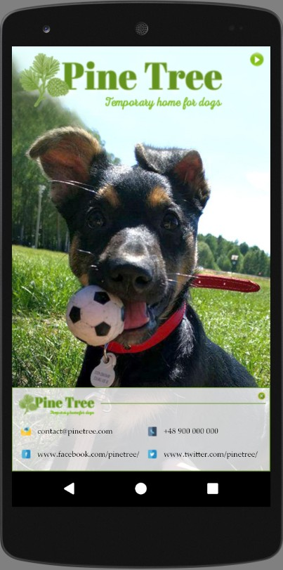

# MakeYourOwnCard
Lesson 4 (Practice Set: Building Layouts) Mini Project for Google Developer Challenge Scholarship: Android Basics

It is a simple android app, which is actually a business card for a temporary home for dogs but it can be used as a template for any business card.

Main features:
1) Changing of the main image after clicking 'Next' button,
2) Expanding/collapsing information container.

There still can be at least few improvements. Especially buttons & fonts should probably be a bit bigger for a better usability.
I also used one image size for the main image, but actually there should one for each density of the screen: https://stackoverflow.com/questions/37207443/how-to-put-single-image-for-different-screen-size/37207973#37207973. I decided to keep one size to not overcomplicate project, which might be confusing at this stage of the course.

 

 
  

